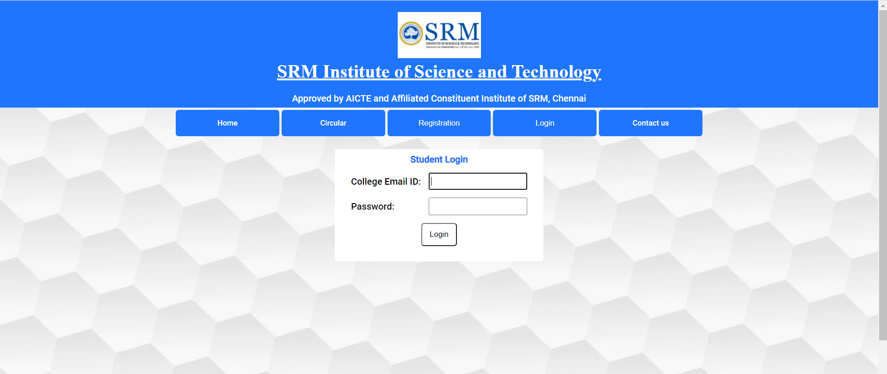

# SRMIST-Portal-Full-Stack-Project-on-ASP.NET-WebForms

This is a full stack web project I made using WebForms and Stored Procedures on .NET Framwork. In this ASP.NET Web application I have tried to make a clone of my College SRMIST login portal.

In this portal, there's a student and Teacher registrations and login. This is a CRUD Full stack where various CRUD operations are done inside logins of Student, Teacher and Dean of the College. Screenshots included will give a clear explanantion of my project.

# SCREENSHOTS

# HOME

# CIRCULAR

# REGISTRATION for Students and Teachers

# TEACHER LOGIN

# TEACHER ACCOUNT DASHBOARD

# DEAN ACCOUNT DASHBOARD

# STUDENT LOGIN

# STUDENT ACCOUNT DASHBOARD

